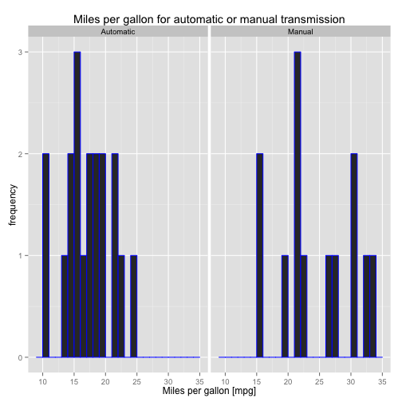
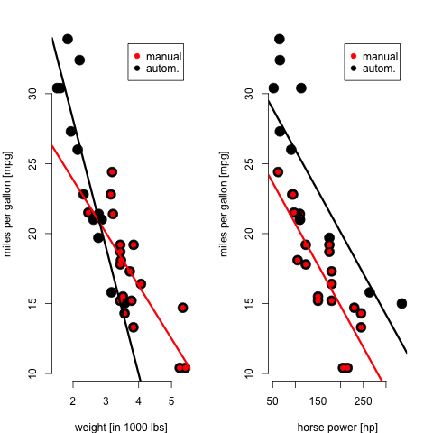
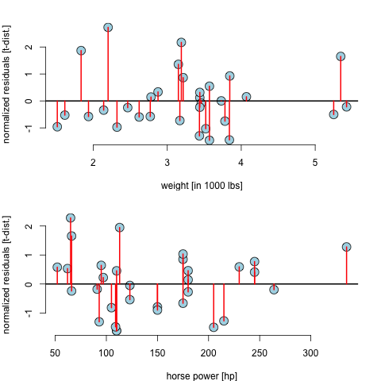

========================================================
title:false

**Manual versus automatic transmission - a Shiny app to generate histograms of miles per gallon with adjustable bin size**

author: Mark A. Jack
date: 10/24/2015
font-family: 'Calibri'

<small>A Shiny application is presented that allows to adjust the bin size in histograms 
illustrating the miles-per-gallon (mpg) for automatic and manual transmission from the data set **mtcars**.</small>

The Shiny app - a 'bin size' slider 
========================================================

 
***
<small>*Figure 1:* Two histograms of mpg values in *mtcars* data set for  automatic *(am=1)* and manual transmission *(am=0)*.

The bin size in both histograms may be adjusted interactively with a slide bar. The bin size can be varied between 1 and 40 in units of 1 mile-per-gallon. 

See the web link below:
https://mjgrav2001.shinyapps.io/mtcars-app</small>

'mtcars' analysis results - linear regression 
========================================================

***
<small>*Figure 2:* 
- Two linear regression models for manual *(am=0)* and automatic *(am=1)* transmision. 
- Left: Two fits with different slopes with *mpg* as outcome versus *wt* as predictor and interaction *factor(am) wt*. 
- Right: Two fits with equal slopes when fitting *mpg* versus *hp*.</small> 

'mtcars' analysis results - residuals
========================================================

***
*Figure 3:*

Distribution of normalized residuals of regression models (t-student distributions). 

The Shiny app and its application results
========================================================

The Shiny app allows to interactively adjust the bin size in mpg in a histogram. The bin size can be varied between 1 and 40 in units of 1 mile-per-gallon *(mpg).*

<small>**Main results:**
- An average downwards shift of about 5 mpg can be seen when switching from *am=1* to *am=0*. 
- This differentiation is due to a relevant interaction *factor(am) wt*. 
- Automatic transmission *(am=1)* favorable for higher gas mileage when weights are smaller. 
- Cross-over happens around 3000 lbs where manual transmission *(am=0)* starts yielding higher mpg values.</small>
